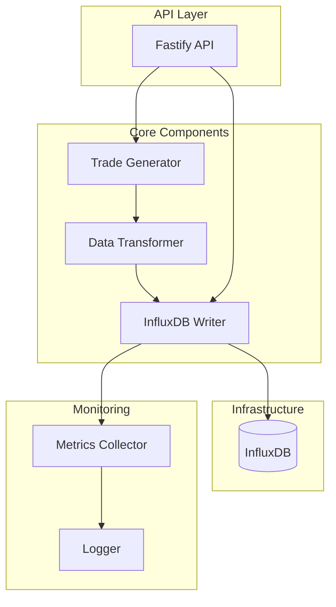

# OHLCV-POC Documentation

This documentation provides detailed information about the OHLCV-POC project, which is a proof of concept for writing large volumes of trade data to InfluxDB.

## Table of Contents

1. [Overview](#overview)
2. [Architecture](#architecture)
3. [Components](#components)
4. [Data Model](#data-model)
5. [API Endpoints](#api-endpoints)
6. [Configuration](#configuration)
7. [Performance Considerations](#performance-considerations)
8. [Testing](#testing)
9. [Development Guide](#development-guide)

## Overview

OHLCV-POC is a high-performance time series database solution for financial market data processing and storage. It demonstrates efficient patterns for writing large volumes of trade data (300 million records) to InfluxDB, a purpose-built time series database.

The system generates synthetic trade data spread across the year 2024, with configurable parameters for batch size, symbols, and other settings. It provides a RESTful API for controlling the data generation and ingestion process.

## Architecture

The application follows a clean architecture pattern with clear separation of concerns:



The system uses several design patterns:
- **Repository Pattern** for database interactions
- **Factory Pattern** for creating trade data objects
- **Strategy Pattern** for different data generation approaches
- **Observer Pattern** for monitoring and progress reporting

## Components

### Trade Model

The trade model represents financial trades with the following properties:
- Symbol (e.g., AAPL, MSFT)
- Side (buy or sell)
- Price
- Amount
- Timestamp

### Trade Generator

The trade generator creates synthetic trade data with realistic properties:
- Distributes trades across the configured time period
- Generates realistic price movements using random walk with mean reversion
- Creates trades for a configurable set of stock symbols
- Supports different batch sizes for optimal performance

### InfluxDB Repository

The InfluxDB repository handles writing trade data to InfluxDB:
- Converts trade objects to InfluxDB points
- Implements efficient batch writing
- Handles error conditions and retries
- Manages connections to InfluxDB

### Trade Ingestion Service

The trade ingestion service coordinates the data generation and writing process:
- Manages the overall ingestion workflow
- Provides progress reporting through events
- Handles error conditions
- Supports starting and stopping the ingestion process

### Fastify API

The Fastify API provides HTTP endpoints for controlling the ingestion process:
- Start and stop ingestion
- Get ingestion status and progress
- Get configuration information

## Data Model

### Trade Object

```typescript
interface Trade {
  symbol: string;       // Stock symbol (e.g., AAPL)
  side: TradeSide;      // Buy or sell
  price: number;        // Trade price
  amount: number;       // Trade amount/volume
  timestamp: Date;      // When the trade occurred
}

enum TradeSide {
  BUY = 'buy',
  SELL = 'sell',
}
```

### InfluxDB Data Structure

Trades are stored in InfluxDB with the following structure:

- **Measurement**: `trade`
- **Tags**:
  - `symbol`: Stock symbol
  - `side`: Buy or sell
- **Fields**:
  - `price`: Trade price (float)
  - `amount`: Trade amount (integer)
- **Timestamp**: Trade timestamp

## API Endpoints

### GET /api/status

Returns the current status of the trade ingestion process.

**Response**:
```json
{
  "status": "idle|running|completed|error",
  "progress": {
    "processed": 1000000,
    "total": 300000000,
    "percentage": 0.33,
    "elapsedMs": 60000,
    "estimatedRemainingMs": 12000000,
    "tradesPerSecond": 16666.67
  },
  "error": "Error message (if status is error)"
}
```

### POST /api/start

Starts the trade ingestion process.

**Response**:
```json
{
  "message": "Trade ingestion started"
}
```

### POST /api/stop

Stops the trade ingestion process.

**Response**:
```json
{
  "message": "Trade ingestion stopped"
}
```

### GET /api/config

Returns the current configuration.

**Response**:
```json
{
  "totalTrades": 300000000,
  "batchSize": 10000
}
```

## Configuration

The application is configured through environment variables:

| Variable | Description | Default |
|----------|-------------|---------|
| `PORT` | HTTP server port | 3000 |
| `INFLUXDB_URL` | InfluxDB URL | http://localhost:8086 |
| `INFLUXDB_TOKEN` | InfluxDB authentication token | my-super-secret-auth-token |
| `INFLUXDB_ORG` | InfluxDB organization | ohlcv-poc |
| `INFLUXDB_BUCKET` | InfluxDB bucket | trades |
| `TOTAL_TRADES` | Total number of trades to generate | 300000000 |
| `BATCH_SIZE` | Batch size for writing to InfluxDB | 10000 |
| `START_DATE` | Start date for trade timestamps | 2024-01-01T00:00:00Z |
| `END_DATE` | End date for trade timestamps | 2024-12-31T23:59:59Z |
| `SYMBOLS` | Comma-separated list of stock symbols | AAPL,MSFT,AMZN,GOOGL,META |
| `LOG_LEVEL` | Logging level | info |

## Performance Considerations

### Batch Size Optimization

The batch size for writing to InfluxDB has a significant impact on performance. The optimal batch size depends on several factors:

- Available memory
- Network latency
- InfluxDB server capacity
- Data complexity

The application includes a performance test that can be used to find the optimal batch size for a specific environment.

### Memory Management

The application is designed to handle large volumes of data without excessive memory usage:

- Trades are generated and written in batches
- Memory is released after each batch is processed
- The batch size can be adjusted to control memory usage

### InfluxDB Write Optimization

The application uses several techniques to optimize writes to InfluxDB:

- Batch writing
- Proper tag and field selection
- Appropriate time precision
- Connection pooling

## Testing

The application includes comprehensive tests:

### Unit Tests

Unit tests cover individual components in isolation:
- Trade model
- Trade generator
- InfluxDB repository
- Trade ingestion service

### Integration Tests

Integration tests verify the interaction between components:
- InfluxDB repository with a real InfluxDB instance

### End-to-End Tests

End-to-end tests verify the complete workflow:
- API endpoints
- Data generation and ingestion

### Performance Tests

Performance tests measure the throughput and resource usage:
- Different batch sizes
- Memory usage
- CPU utilization

## Development Guide

### Prerequisites

- Node.js (v18 or later)
- npm (v8 or later)
- Docker and Docker Compose (for running InfluxDB locally)
- Git

### Setup

1. Clone the repository:
   ```bash
   git clone https://github.com/jeansouza/ohlcv-poc.git
   cd ohlcv-poc
   ```

2. Install dependencies:
   ```bash
   npm install
   ```

3. Start InfluxDB using Docker Compose:
   ```bash
   npm run docker:up
   ```

### Development

Run the application in development mode:

```bash
npm run dev
```

### Testing

Run all tests:

```bash
npm test
```

Run specific test suites:

```bash
npm run test:unit        # Unit tests
npm run test:integration # Integration tests
npm run test:e2e         # End-to-end tests
npm run test:performance # Performance tests
```

Check test coverage:

```bash
npm run test:cov
```

### Building

Build the application:

```bash
npm run build
```

Run the built application:

```bash
npm start
```

### Code Style

The project uses ESLint and Prettier for code style enforcement:

```bash
npm run lint     # Check for linting issues
npm run format   # Format code
```

### TypeScript Best Practices

- Use strict typing for all variables and functions
- Properly address TypeScript errors rather than bypassing the compiler
- Use interfaces for defining data structures
- Use enums for defining constants
- Use type assertions only when necessary and with caution
