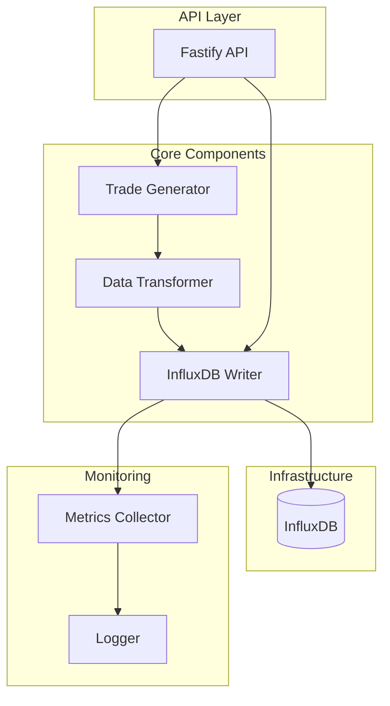
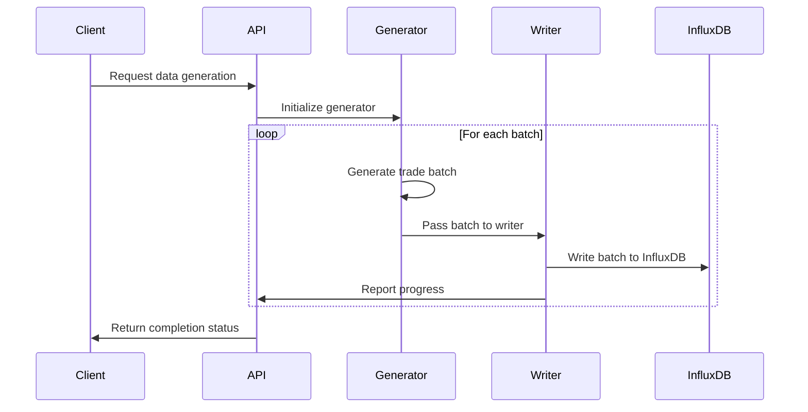

# System Patterns: OHLCV-POC

## Architecture Overview

## Key Design Patterns

### Repository Pattern
- Used for database interactions
- Abstracts InfluxDB-specific implementation details
- Provides clean interfaces for data operations
- Facilitates testing through mock implementations

### Factory Pattern
- Used for creating trade data objects
- Ensures consistent data structure
- Simplifies the generation of test data
- Supports different trade data variations

### Strategy Pattern
- Used for different data generation approaches
- Allows for configurable data distribution strategies
- Supports various temporal distribution patterns
- Enables performance comparison between strategies

### Observer Pattern
- Used for monitoring and progress reporting
- Provides real-time feedback on data ingestion
- Decouples monitoring from core data processing
- Enables extensible metrics collection

## Data Flow

## Component Responsibilities

### Trade Generator
- Creates synthetic trade data
- Distributes trades across the time period
- Ensures data volume requirements are met
- Produces realistic price movements

### Data Transformer
- Converts trade objects to InfluxDB point format
- Handles data type conversions
- Optimizes data structure for efficient storage
- Validates data integrity

### InfluxDB Writer
- Manages connections to InfluxDB
- Implements efficient batch writing
- Handles error conditions and retries
- Tracks write performance metrics

### Fastify API
- Provides HTTP endpoints for operations
- Handles request validation
- Manages asynchronous processing
- Returns appropriate status codes and responses

## Error Handling Strategy
- Comprehensive error categorization
- Graceful degradation under load
- Detailed error logging
- Retry mechanisms with exponential backoff
- Circuit breaker pattern for external dependencies

## Performance Considerations
- Batch size optimization
- Connection pooling
- Memory usage monitoring
- Asynchronous processing
- Resource throttling
- Parallel writing where appropriate
